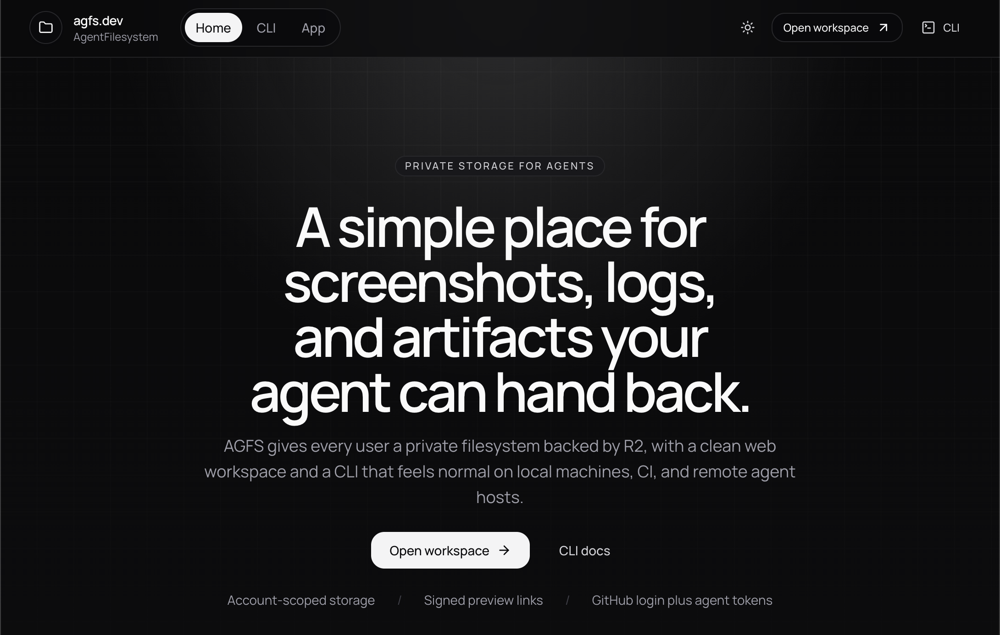

# agfs.dev

AgentFilesystem is a Cloudflare-native file manager for humans and agents.

## Workspace

- `apps/web`: TanStack Start app and stateless MCP endpoint on Cloudflare Workers
- `apps/preview`: isolated preview Worker at `preview.agfs.dev`
- `packages/contracts`: shared Zod API contracts
- `packages/db`: Drizzle schema, helpers, and SQL migrations
- `packages/cli`: Node CLI for login and filesystem management

## Planned setup

1. Install dependencies with `pnpm install`
2. Configure secrets for GitHub OAuth
3. Run `pnpm --filter @agfs/web cf-typegen`
4. Run `pnpm dev`

`pnpm dev` now auto-applies local D1 migrations before the TanStack Start worker boots, so the Better Auth and AGFS tables stay in sync with local development.

## Environment

Copy `.env.example` into your local secret manager or Worker secret setup and provide:

- `BETTER_AUTH_SECRET`, `GITHUB_CLIENT_ID`, `GITHUB_CLIENT_SECRET`
- Optional: `PAID_PLAN_EMAILS` as a comma-delimited list for accounts that should resolve to the paid plan
- `R2_BUCKET_NAME` (non-secret; supplied by Wrangler)
- `APP_URL` and `PREVIEW_URL`
- `PREVIEW_SIGNING_SECRET`: a random 32-byte secret shared only by the app and preview Workers

For local Cloudflare development, put Worker secrets in `apps/web/.dev.vars.example` as `apps/web/.dev.vars`. `wrangler.jsonc` already supplies `APP_URL` and `R2_BUCKET_NAME` as non-secret vars.

`PAID_PLAN_EMAILS` is optional. If set, each comma-delimited email in the list is normalized and granted the paid storage plan.

The web app and CLI use resumable R2 multipart transfers in 8 MiB chunks (up to 20 GB per file, subject to account quota). Re-select the same file or repeat the CLI upload command within 24 hours to resume. Every previously uploaded part is rehashed before reuse. The legacy single-request endpoint remains capped at 100 MB.

Deletion moves files to trash, and overwrites retain the previous version, for 30 days. Restore to a vacant path through **Trash & versions** or the CLI. Retained physical objects count toward storage exactly once. Permanent removal releases their storage when no live file or version references them. Shared downloads remain attachments; private previews use short-lived signed URLs on a separate Worker that has no app auth or database binding.

Hourly cleanup expires abandoned uploads, retained files, and unused device authorizations. Activity is retained for 90 days. New API tokens expire in 30 days by default (maximum 90), with `read`, `write`, `delete`, `share`, and account-level `manage` permissions and a literal folder boundary. Existing tokens keep their prior access; web-issued agent tokens cannot manage credentials. Device login issues a 30-day account management token.

## Stateless MCP

Connect an HTTP MCP client to `https://agfs.dev/mcp` with an `Authorization: Bearer <AGFS_TOKEN>` header. Create a scoped token at `/app/tokens`. The official TypeScript SDK v2 `createMcpHandler` serves the **2026-07-28** stateless protocol and legacy stateless Streamable HTTP on the same endpoint, without session IDs or server affinity. Tokens are verified on every request; every tool uses the same REST authorization checks.

Example client configuration (environment-variable syntax varies by client):

```json
{
  "mcpServers": {
    "agfs": {
      "url": "https://agfs.dev/mcp",
      "headers": { "Authorization": "Bearer ${AGFS_TOKEN}" }
    }
  }
}
```

Tools cover listing, trees, text reading/writing, folders, moves, trash, recovery, shares, previews, activity, and starting larger uploads. `fs_read` is limited to 1 MiB; `fs_write` accepts up to 8,192 text characters within the endpoint's 16 KiB JSON limit. Larger binary transfers use the authenticated multipart HTTP API. This endpoint uses manually issued AGFS tokens; it does not advertise an OAuth authorization server.

```bash
agfs tokens create reader --path /project --permissions read --ttl 7d
agfs upload ./artifact.zip /project/artifact.zip  # repeat to resume
agfs versions /project/artifact.zip
agfs trash /project
agfs restore <recovery-id> /project/restored.zip
agfs preview /project/log.txt
agfs activity
```

Build the updated CLI from this checkout with `pnpm --filter @agfs/cli build`; run `node packages/cli/dist/index.js`. Publishing the CLI to npm is a separate release step.

## Useful commands

- `pnpm dev`: start the TanStack Start app locally
- `pnpm d1:migrate:local`: apply the full AGFS + Better Auth schema to the local D1 database
- `pnpm d1:migrate:remote`: apply the production D1 schema to Cloudflare
- `pnpm r2:cors`: apply the production R2 CORS policy
- `pnpm deploy:production`: build and deploy the production Worker to `agfs.dev`
- `pnpm check`: run TypeScript checks across the workspace
- `pnpm test`: run unit tests
- `pnpm --filter @agfs/web cf-typegen`: generate local Cloudflare binding types

## Cloudflare resources

- One D1 database named `agfs-db` bound as `DB`
- One R2 bucket named `agfs-files` bound as `FILES_BUCKET`
- Worker upload capabilities hashed in D1; R2 access through the bucket binding

The repository is now wired to the live D1 database ID `e40aac3b-5468-468c-b110-ac6a6ca4cece` and a dedicated Wrangler `production` environment that deploys to the custom domain `agfs.dev`.

## Production deploy checklist

1. Create a production GitHub OAuth app with:
   - Homepage URL: `https://agfs.dev`
   - Authorization callback URL: `https://agfs.dev/api/auth/callback/github`
2. Confirm the `FILES_BUCKET` binding points to `agfs-files`; an S3 API token is not required.
3. Set the production Worker secrets:

   ```bash
   pnpm --filter @agfs/web exec wrangler secret put BETTER_AUTH_SECRET --env production
   pnpm --filter @agfs/web exec wrangler secret put GITHUB_CLIENT_ID --env production
   pnpm --filter @agfs/web exec wrangler secret put GITHUB_CLIENT_SECRET --env production
   ```

4. Apply the R2 CORS policy:

   ```bash
   pnpm r2:cors
   ```

5. Apply database migrations:

   ```bash
   pnpm d1:migrate:remote
   ```

6. Set the same `PREVIEW_SIGNING_SECRET` on both Workers, deploy the preview Worker, then deploy the app:

   ```bash
   pnpm --dir apps/web exec wrangler secret put PREVIEW_SIGNING_SECRET --env production
   pnpm --dir apps/preview exec wrangler secret put PREVIEW_SIGNING_SECRET
   pnpm --dir apps/preview run deploy
   ```

   For a new environment, create the preview Worker with `wrangler deploy` before setting its secret. Use the same secret value for both commands. Never commit it.

   Deploy the app:

   ```bash
   pnpm deploy:production
   ```

7. Smoke test:
   - Sign in with GitHub at `https://agfs.dev`
   - Upload a file in the web app
   - Create a share link and open it in a private window
   - Run `AGFS_BASE_URL=https://agfs.dev agfs whoami`
   - Run `AGFS_BASE_URL=https://agfs.dev agfs upload ./shot.png /screenshots/shot.png --share 15m`

## Cloudflare Git deploys

Production deploys now come from Cloudflare's Git integration in the Cloudflare dashboard.

Recommended settings for this repository:

- Worker / project: `agfs-dev-production`
- Git repository: `nearbycoder/agfs`
- Production branch: `main`
- Root directory: repository root
- Build command: `pnpm --dir apps/web run build:production`
- Deploy command: `pnpm --dir apps/web exec wrangler deploy --env production`

Optional watch paths that fit this monorepo well:

- `apps/web/**`
- `apps/preview/**`
- `packages/**`
- `package.json`
- `pnpm-lock.yaml`
- `pnpm-workspace.yaml`
- `tsconfig.base.json`

If Cloudflare enables preview builds for non-production branches and asks for a preview deploy command, use:

```bash
pnpm --dir apps/web exec wrangler versions upload --env production
```

The production app secrets still live in Cloudflare, not GitHub:

- `BETTER_AUTH_SECRET`
- `GITHUB_CLIENT_ID`
- `GITHUB_CLIENT_SECRET`

## Security verification

Run `pnpm security:check` to audit dependencies, run regression tests, build, and typecheck the workspace. Production builds also run the workspace tests before compiling. Dependabot checks npm workspace dependencies weekly.

The September 2026 review and deployment verification are documented in [SECURITY-AUDIT.md](./SECURITY-AUDIT.md). `scripts/security-smoke.mjs` runs only against localhost:8787 and expects disposable local users `alice` and `bob` with API tokens `agfs_local_test_alice` and `agfs_local_test_bob`. Never seed these fixtures in production.

Local feature verification: apply migrations to `/tmp/agfs-audit-state`, seed the disposable users described above, and start the built app on 8787 and preview Worker on 8788 using that same persistence directory. Set matching local-only preview signing secrets. Run `node scripts/security-smoke.mjs` and `node scripts/features-smoke.mjs`. The latter covers both protocol generations with the official MCP client, scoped tokens, recovery, multipart resume, and preview isolation. Invoke `/cdn-cgi/local/scheduled` to test cron locally. Never expose this local fixture environment publicly.

The feature rollout and verification are documented in [AGENT-UPGRADE.md](./AGENT-UPGRADE.md).

## Collaborative agent platform

AGFS now includes search and tags, browser OAuth for MCP, shared workspaces, conditional writes, signed webhooks, run manifests, reviewed drafts, CLI sync/watch, TypeScript and Python SDKs, and agent/workspace budgets. See [the platform guide](docs/platform.md) for workflows, API routes, limits, and release verification.

AGFS 0.4 adds recovery snapshots and verified backups, safer public sharing and credential rotation, incremental parallel sync, SDK browser OAuth, queue processing, operational alerts, retained run files, and workspace review/ownership controls. See the [reliability guide](docs/reliability.md) for setup, commands, retention limits, and release configuration.
